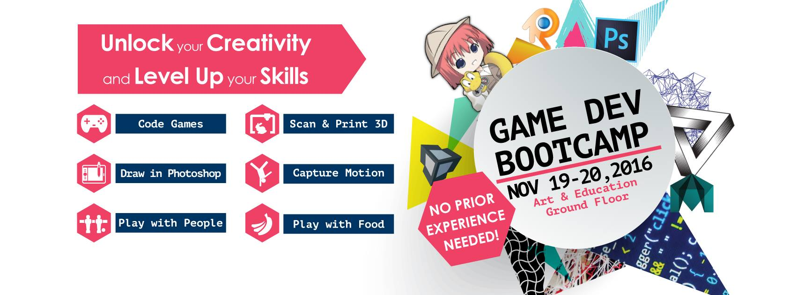

Do you love playing games? We do, too! Ever wonder how to make your own game? We do, too! That's why we're inviting you to participate in an exclusive, two-day, first ever Game Development Bootcamp designed for students from all backgrounds and skills to join in a series of workshops held over the course of a weekend.  You can choose from one or take all workshops.  Unlock your creativity  and level up your skills. Use them any time or at the CSU east Bay Game Jams this Winter and Spring.

### Register Now! seating is limited for some sections [https://goo.gl/PYNKu2](https://goo.gl/PYNKu2)

## Saturday
***9:00 - 12:00*** - [Scan Your Body For 3D Avatars](https://channel9.msdn.com/coding4fun/kinect/3D-Scanning-with-Kinect-V2): Use a 3Dscanner to create a model of yourself that you can edit, animate and print in 3d. Limited slots available  - register now!

***9:00 - 12:00*** - [Create Awesome 3D Wearable Heads with Paper](http://petapixel.com/assets/uploads/2013/01/3dportrait-5.jpg): Make a giant head out of paper and wear it around campus or your home.  So fun!

***11:00 - 4:00*** - Are you a boardgamer? [Play Board Games And Meet New Friends](http://kotaku.com/5903243/board-games-are-better-than-video-games-in-so-many-ways) At The Game Playing Lounge - bring your friends - have a blast!

#### Lunch Break - Public Welcome (12:00 - 1:00) 

***1:00 - 2:50*** - [Explore The Unity Game Engine For Beginners](https://unity3d.com): Unity is the game engine of choice for developers and it is free for students! This workshop shows you how to get started with Unity and make your first game.  This is a workshop for people with a passion dive into video game making.  No prior experience needed. 

***3:10 - 5:00***  - [Create Interactive Novels With RenPy For Beginners](https://www.renpy.org): Do you love interactive visual novels, are you ready to make your own interactive visual novel, but you don't know where to start?  This workshop is for you! Come join us in exploring the RenPy visual novel environment and get started on your masterpiece today!

#### Dinner Break (5:00 - 6:00)

***6:00 - 8:00*** - [Learn 3D-Printing	 & Preparing To Print](http://lifehacker.com/how-to-get-started-with-3d-printing-without-spending-a-1340345210): Are you curious about 3D printing?  Let's get started on making the files work with 3d printers.  Set them up and print.  You can grab your model tomorrow.  Combine this with the 3d scanning for the ultimate selfie!

## Sunday
***10:00 - 12:00***  - Discover [Drawing In Adobe Photoshop](http://smashinghub.com/25-really-useful-photoshop-drawing-tutorials.htm): Have you ever wondered how to use photoshop to draw with digital pens?  This workshop is for you.  Spend the morning excercising your creative muscles and draw with us. Combine this workshop with the RenPy visual interactive novel making for maximum effect!

***11:00 - 4:00*** - Are you a boardgamer? [Play Board Games And Meet New Friends](http://kotaku.com/5903243/board-games-are-better-than-video-games-in-so-many-ways) At The Game Playing Lounge - bring your friends - have a blast!

#### Lunch Break and Short Talks (12:00 - 1:00)

1. ***12:00 - 1:00*** - [Play With Your Food And Makeymakeys](http://makeymakey.com): Check out this crazy stuff and play with your food using these digital tools.
2. ***12:00 - 1:00*** - The Making Of Monster King - How do you make a game that let's you kick buildings around with your feet? Find out here.
3. ***12:00 - 1:00*** - Drone Hacking at HackDay - How do you hack drones to catch moquitos? Find out at this talk!

***1:00 - 3:00*** - Discover Motion Capture With Kinect, Ni Mate & Blender: Lear how to use a cheap kinect sensor to create virtual puppets that do you bidding.  Are you ready?

***3:00 - 4:00*** - [Performance & Avatars: Physical Motion In Virtual Space](https://youtu.be/NxbH-QDHAVg): Join us as we learn to combine 3d scans, motion capture to make the virtual world come to life.  Get ready to give Pixar a run for their money.

***4:00 - 5:00*** - Pick Up 3D Prints: if you attended the workshop on saturday - your print may be ready.  Perhaps you just want to see what those things look like - you are welcome too!

***Unless Noted All Workshops Are Designed For People Without Any Prior Experience***

### Register Now! seating is limited for some sections [https://goo.gl/PYNKu2](https://goo.gl/PYNKu2)

